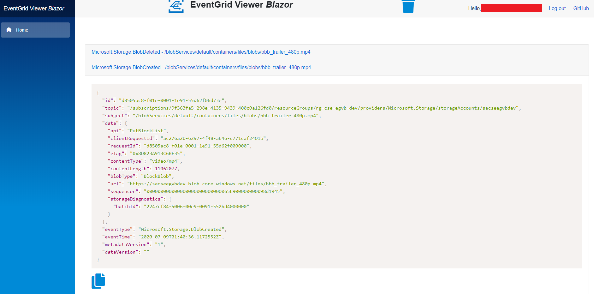
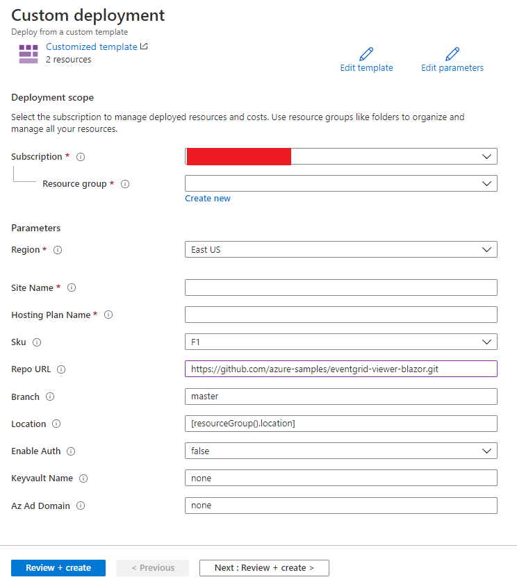

# Overview

The EventGrid Viewer Blazor application can be used to view [Azure EventGrid](https://docs.microsoft.com/en-us/azure/event-grid/overview) messages in realtime using [ASP.Net Core Blazor](https://docs.microsoft.com/en-us/aspnet/core/blazor/?view=aspnetcore-3.1) & [SignalR](https://docs.microsoft.com/en-us/aspnet/signalr/overview/getting-started/introduction-to-signalr).  For those who would like to secure the application, the EventGrid Viewer Blazor application can be easily configured via appsettings to use Azure AD authentication, Azure KeyVault & Managed Identities.


Building upon some of the ideas of the [azure-event-grid-viewer](https://github.com/Azure-Samples/azure-event-grid-viewer), the EventGrid Viewer Blazor application was written in [Blazor](https://dotnet.microsoft.com/apps/aspnet/web-apps/blazor) and offers the following features:

1. View all Azure EventGrid messages in json format
1. View formatted & highlighted json
1. Copy json messages to the clipboard
1. Enable Azure AD authentication to secure the application

## Screenshot



## Usage

To quickly deploy the EventGrid Viewer Blazor application to Azure, hit the button below *(for examples on how to deploy with Azure AD authentication, see the [examples section](#examples))*:

[](https://portal.azure.com/#create/Microsoft.Template/uri/https%3A%2F%2Fraw.githubusercontent.com%2FAzure-Samples%2Feventgrid-viewer-blazor%2Fmain%2Finfrastructure%2Farm%2Fazuredeploy.json)

You will be presented with a screen similar to the image below:



Do the following:

1. Create or Select a Resource Group
1. Enter a Site Name
1. Enter a Hosting Plan Name
1. Hit the *Review + Create* button to validate & deploy the EventGrid Viewer Blazor application

Use the Webhook endpoint:

 ```https://{{site-name}}.azurewebsites.net/api/eventgrid```

 to [subscribe to EventGrid events](https://docs.microsoft.com/en-us/azure/event-grid/subscribe-through-portal).

## Examples

In the *examples* folder, examples have been created to demonstrate how to automate the deployment of the EventGrid Viewer Blazor application with or without authentication.  You can read more [here](examples).
