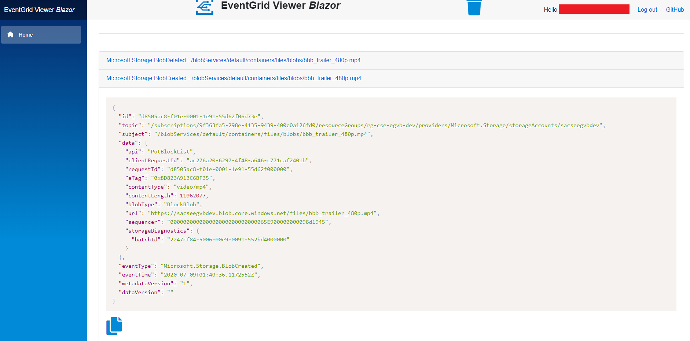

# 🌐 EventGrid Viewer Blazor

[](https://github.com/Azure-Samples/eventgrid-viewer-blazor/actions)
[](https://opensource.org/licenses/MIT)
[](https://dotnet.microsoft.com/download)
[](https://azure.microsoft.com/services/event-grid/)

> A modern, real-time Azure EventGrid message viewer built with ASP.NET Core Blazor and SignalR


## 📋 Table of Contents

- [✨ Features](#-features)
- [🚀 Quick Start](#-quick-start)
- [🔧 Prerequisites](#-prerequisites)
- [📦 Deployment](#-deployment)
- [📸 Screenshots](#-screenshots)
- [🎯 Usage](#-usage)
- [🔒 Security](#-security)
- [🤝 Contributing](#-contributing)

## ✨ Features

Building upon the ideas of [azure-event-grid-viewer](https://github.com/Azure-Samples/azure-event-grid-viewer), this Blazor application offers:

- ✅ **Real-time Event Viewing** - View Azure EventGrid messages as they arrive
- ✅ **JSON Formatting** - Beautifully formatted and syntax-highlighted JSON
- ✅ **Copy to Clipboard** - One-click copying of event data
- ✅ **Modern UI** - Clean, responsive Blazor interface
- ✅ **SignalR Integration** - Real-time updates without page refresh
- 🔄 **Entra ID Authentication** - *Coming Soon*

## 🚀 Quick Start

Get up and running in under 2 minutes:

```bash
# 1️⃣ Clone the repository
git clone https://github.com/Azure-Samples/eventgrid-viewer-blazor.git
cd eventgrid-viewer-blazor

# 2️⃣ Deploy to Azure (one command!)
azd auth login
azd up
```

> 🎉 **That's it!** Your EventGrid viewer will be deployed and ready to use.

## 🔧 Prerequisites

Before you begin, ensure you have:

- **Azure Subscription** - [Get a free account](https://azure.microsoft.com/free/)
- **Azure Developer CLI** - [Install azd](https://aka.ms/azure-dev/install)
- **.NET 9.0 SDK** - [Download here](https://dotnet.microsoft.com/download) *(for local development)*
- **Modern Browser** - Chrome, Firefox, Safari, or Edge

## 📦 Deployment

### 🌟 Option 1: Azure Developer CLI (Recommended)

The fastest way to deploy with full Azure resource provisioning:

```bash
# Install azd if you haven't already
winget install microsoft.azd     # Windows
brew tap azure/azd && brew install azd  # macOS
curl -fsSL https://aka.ms/install-azd.sh | bash  # Linux

# Clone and deploy
git clone https://github.com/Azure-Samples/eventgrid-viewer-blazor.git
cd eventgrid-viewer-blazor
azd auth login
azd up
```

📖 **For detailed azd instructions, environment configuration, and troubleshooting, see [README-azd.md](README-azd.md).**

### 🔗 Option 2: Deploy to Azure Button

Quick deployment using ARM template:

[](https://portal.azure.com/#create/Microsoft.Template/uri/https%3A%2F%2Fraw.githubusercontent.com%2FAzure-Samples%2Feventgrid-viewer-blazor%2Frefs%2Fheads%2Fmain%2Finfra%2Farm%2Fazuredeploy.json)

**Steps:**
1. ✅ Create or select a Resource Group
2. ✅ Enter a unique Site Name
3. ✅ Enter a Hosting Plan Name
4. ✅ Click **Review + Create** to deploy

## 📸 Screenshots



## 🎯 Usage

### Setting up EventGrid Subscription

Once deployed, use your webhook endpoint to subscribe to EventGrid events:

```
https://{{your-site-name}}.azurewebsites.net/api/eventgrid
```

📚 **Learn more:** [Subscribe to EventGrid events](https://docs.microsoft.com/en-us/azure/event-grid/subscribe-through-portal)

### Local Development

<details>
<summary>🔧 <strong>Click to expand local development setup</strong></summary>

```bash
# Clone the repository
git clone https://github.com/Azure-Samples/eventgrid-viewer-blazor.git
cd eventgrid-viewer-blazor

# Restore packages
dotnet restore src/Blazor.EventGridViewer.sln

# Run the application
dotnet run --project src/Blazor.EventGridViewer.ServerApp

# Open browser to
# https://localhost:5001 (or the URL shown in terminal)
```

</details>

## 🔒 Security

> **⚠️ Important:** This application currently runs without authentication. For production use with sensitive data, consider implementing authentication controls.

**Planned Security Features:**
- 🔄 Entra ID authentication integration
- 🔄 Azure Key Vault for secrets management
- 🔄 Managed Identity support

## 🤝 Contributing

We welcome contributions! Here's how you can help:

- 🐛 **Report bugs** - [Open an issue](https://github.com/Azure-Samples/eventgrid-viewer-blazor/issues)
- 💡 **Suggest features** - [Start a discussion](https://github.com/Azure-Samples/eventgrid-viewer-blazor/discussions)
- 🔧 **Submit PRs** - Fork, create feature branch, submit pull request

### Development Stack

- **Frontend:** Blazor Server (.NET 9.0)
- **Real-time:** SignalR
- **Hosting:** Azure App Service
- **Monitoring:** Application Insights

---

<div align="center">

**⭐ If this project helped you, please give it a star!**

Made with ❤️ by the Azure Samples team

</div>
