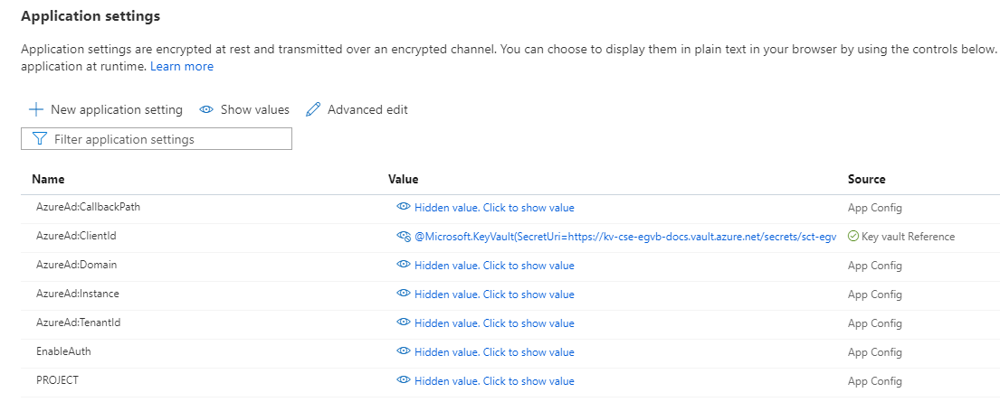

# Overview

The purpose of this document is to provide examples on how to automate the deployment of the EventGrid Viewer Blazor application

## How to Deploy with no Authentication

### Bash

The ```azuredeploy.sh``` bash script was used to deploy the EventGrid Viewer Blazor application during development.  The README on how this script works can be found [here](../infrastructure/README.md#azuredeploy.sh_Script).

### Azure DevOps

Azure DevOps pipelines were used during the development of the EventGrid Viewer Blazor application.  The README on how to either build or deploy the EventGrid Viewer Blazor using Azure DevOps pipelines can be found [here](../infrastructure/azure-pipelines/README.md).

### Terraform

To view an example of how to deploy the EventGrid Viewer Blazor application using terraform, see the README found [here](terraform-no-auth/README.md).

## How to Deploy with Entra ID Authentication

The information inside of EventGrid messages can contain sensitive information.  If a bad actor were to obtain the EventGrid Viewer Blazor url, they could view this information.  The EventGrid Viewer Blazor application has been designed in a way that Entra ID authentication can be enabled through appsettings.

EventGrid Viewer Blazor will use a [Azure Keyvault](https://azure.microsoft.com/en-us/services/key-vault/) Secret, [Entra ID App Registration](https://docs.microsoft.com/en-us/azure/active-directory/develop/active-directory-how-applications-are-added) & a [System-assigned managed Identity](https://docs.microsoft.com/en-us/azure/active-directory/managed-identities-azure-resources/overview) to secure the application.

**EventGrid Viewer Blazor Entra ID Appsettings:**

1. EntraId:Instance - hardcoded in the ARM Template, value is ```https://login.microsoftonline.com/```
1. EntraId:Domain - the primary Azure Domain, ie {youraccount}.onmicrosoft.com
1. EntraId:TenantId - the Azure TenantId
1. EntraId:ClientId - the Entra ID App Registration ClientId.  This value is set to a [Keyvault reference](https://docs.microsoft.com/en-us/azure/app-service/app-service-key-vault-references), for security & so the application can be re-deployed without having to set the ClientId for each deployment *(ARM Template deployments will reset appesettings, if there were changes after deployment)*.
1. EntraId:CallbackPath - hardcoded in the ARM Template, value is "/signin-oidc"
1. EntraId:SignedOutCallbackPath - hardcoded in the ARM Template, value is "/signout-callback-oidc"
1. EnableAuth - a flag that determines whether the application will enable/disable Entra ID authentication

**Note:** The Keyvault secret name that will contain the EntraId:ClientId value is set by the ARM Template & the name is: *sct-egvb-azad-client-id*

**How it works:**

1. When deploying the application, using the ARM Template (ie Bash, Terraform etc etc):
   1. Set EnableAuth = true
   1. Set azAdDomain = {youraccount}.onmicrosoft.com
   1. Set keyvaultName = your_existing_keyvault_name

When the application is deployed, the application will have the appsettings similar to the picture below:



1. Once the EventGrid Viewer Blazor application is deployed, a script needs to be run (manual or automated) to:
   1. Create a Entra ID App Registration
   1. Store the Entra ID App Registration ClientId in a Azure KeyVault secret named **sct-egvb-azad-client-id**
   1. Stop/start the the EventGrid Viewer Blazor application

The [configure-auth.sh](shared/configure-auth.sh) used in the examples performs these tasks & can be used.  To find out how to use this bash script, execute the following command for help:

```bash
    chmod +x configure-auth.sh && ./configure-auth.sh -h
```

**Note:** The [configure-auth-manifest.json](shared/configure-auth-manifest.json) file needs to be in the same directory as the ```configure-auth.sh``` script, when it is executed.

Once you have deployed the application & run ```configure-auth.sh``` (or your own script), users should now be challenged with credentials when trying to access the EventGrid Viewer Blazor application.

### Bash

The README on how to configure the EventGrid Viewer Blazor application with Entra ID authentication using bash can be found [here](bash-auth/README.md).

### Terraform

To view an example of how to deploy the EventGrid Viewer Blazor application with Entra ID authentication using terraform, the guide can be found [here](terraform-auth/README.md).
