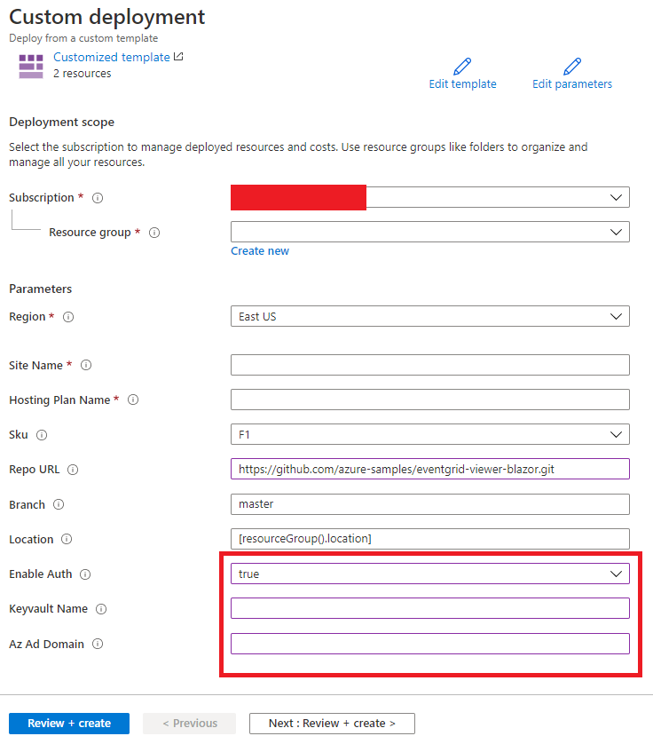

# Overview

The purpose of this document is to demonstrate how to configure the EventGrid Viewer Blazor application with Azure AD authentication using bash, once the application has been deployed.  You could use the bash script as part of an automated process.

## Prerequisites

1. Azure Account
1. Elevated permissions to create Azure Service Principals
1. An existing [Azure Keyvault](https://docs.microsoft.com/en-us/azure/key-vault/secrets/quick-create-portal)
1. Docker *(optional)*

Instructions:

1. Create an Azure Keyvault, if one does not exist.

1. Use the *Deploy to Azure* button below to quickly deploy the application. Use the image below as a guide.

[](https://portal.azure.com/#create/Microsoft.Template/uri/https%3A%2F%2Fraw.githubusercontent.com%2FAzure-Samples%2Feventgrid-viewer-blazor%2Fmain%2Finfrastructure%2Farm%2Fazuredeploy.json)

You will be presented with a screen similar to the image below:



Do the following:

1. Create or Select a Resource Group
1. Enter a Site Name
1. Enter a Hosting Plan Name
1. Enable Auth
1. Enter a Keyvault Name
1. Enter a Azure AD Domain ie {youraccount}.onmicrosoft.com
1. Hit the *Review + Create* button to validate & deploy the EventGrid Viewer Blazor application

After the application is deployed:

1. You will need to set the Terraform environment variables when you run the docker container.  You will need to provide:
   - A azure subscription
   - A resource group name
   - A web app name
   - A keyvault name
1. Run the following bash commands in order:

```bash
    # build image
    docker build -t egvb-samples .

    # Replace the environment variables
    docker run -it -e AZURE_SUBSCRIPTION_ID=<azure_subscription_id> -e resource_group_name=<resoure_group> -e web_app_name=<app_name> -e key_vault_name=<key_vault_name> egvb-samples

    # switch to bash-auth directory
    cd bash-auth

    # for script usage example
    # ./configure-auth.sh -h

    # execute script with parameters used with deploy to azure button to configure deployed app with az ad authentication
    ./configure-auth.sh -s $AZURE_SUBSCRIPTION_ID -g $resource_group_name -a $web_app_name -k $key_vault_name
```

## Teardown

Copy the App Registration AppId from the output of the ```configure-auth.sh``` script.


```bash
    az group delete -n $resource_group_name  && az ad app delete --id <app_id>
```
