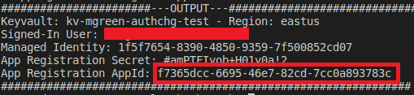

# Overview

## Prerequisites

1. Azure Account
1. Elevated permissions to create Azure Service Principals
1. Docker *(optional)*
1. Basic knowledge of [Terraform](https://www.terraform.io/)

### Azure Resources

- Resource Group
- App Service Plan
- Web App Service
- Keyvault
- eventgrid-viewer-blazor code
- App Registration

Instructions:

**Note:** If you have already have terraform & azure-cli installed, you just need to login to azure using azure-cli & set the default subscription.

1. Open a terminal and switch to the *examples* directory
1. Run ```docker build -t egvb-samples .```
1. You will need to set the Terraform environment variables when you run the docker container.  You will need to provide:
   - A azure subscription
   - A resource group name
   - A resource group region
   - A app service plan name
   - A web app name
   - A keyvault name
   - A azure ad domain
1. Run the following bash commands in order:

```bash
    # Replace the environment variables
    docker run -it -e AZURE_SUBSCRIPTION_ID=<azure_subscription_id> -e TF_VAR_resource_group_name=<resoure_group> -e TF_VAR_resource_group_region=<region> -e TF_VAR_web_app_name=<app_name> -e TF_VAR_app_service_plan_name=<app_serviceplan> -e TF_VAR_key_vault_name=<key_vault_name> -e TF_VAR_az_ad_domain=<az_ad_domain> egvb-samples

    # login into azure
    az login

    # set the default azure subscription
    az account set -s $AZURE_SUBSCRIPTION_ID

    # switch to the terraform-auth directory
    cd terraform-auth

    # init terraform
    terraform init

    # terraform plan to view plan
    terraform plan

    # terraform apply to deploy
    terraform apply
```

1. Once the application has been deployed, configure Azure AD authentication by running the following:

```bash
    ./configure-auth.sh -s $AZURE_SUBSCRIPTION_ID -g $TF_VAR_resource_group_name -a $TF_VAR_web_app_name -k $TF_VAR_key_vault_name
```

## Teardown

Copy the App Registration AppId from the output of the ```configure-auth.sh``` script.



```bash
    terraform destroy && az ad app delete --id <app_id>
```
